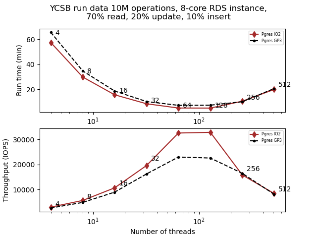
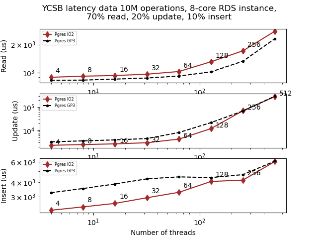
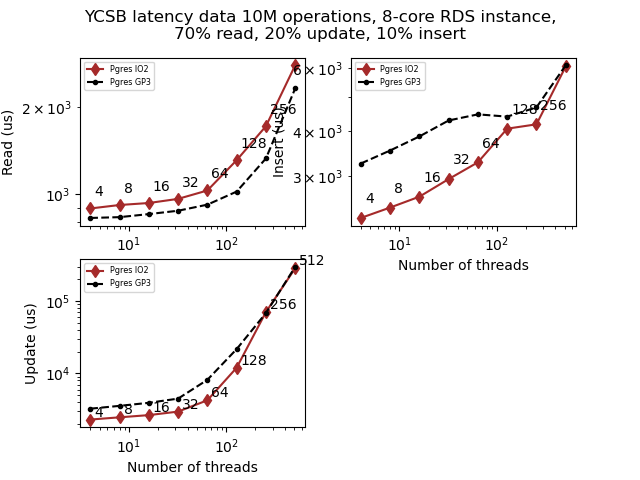

### Purpose

This code is meant to make multi-page graphs of x/y data with subplots easier to use to plot the results of multi-factor experiments. It's based entirely on matplotlib. It uses a configuration file to detail how many pages of graphs to make, how many graphs per page and their layout, which data sets to plot and how, and more. It also allows for modifying data elements prior to graphing, such as rounding, multiplying or adding constants, and so on.

### Config

The default config file is called graphsetup.cfg, but using -c or --conf on the command line an alternative file can be used instead. The configuration sections are BASE, where the list of pages, graphs, and datasets are detailed as well as the location to save files; Graph layouts, where each graph and page mentioned in BASE are fully detailed; and the Dataset section where the input filename convention for each dataset is laid out as well as the line format for each dataset on the graphs.

### Input files

Other than the config file, there are a number of xy-data files. Each of these files corresponds to a single line on a single graph, meaning that at most there will be a number of files equal to the number of graphs times the number of data sets. These files contain the locations of data points, but they do not need to be in order since that is managed internally. Each data set can have a different filename convention, which is detailed in the config file. Each line is one data point, with the x and y values separated by a space or a comma.

### Data processing

The main() function is fairly short, and does the following: read and parse the configuration file while creating an internal data structure to match; read each of the input data files; prepare and massage the data as needed; graph the data as detailed in the config file; and output an optional collated data file of processed, sorted CSV data.

### Outputs

The output files can be in any format that matplotlib can create, and are determined by the filenames in the config file. If the filename is out.pdf, a PDF file is saved, but if it shows out.jpg a JPG file will be saved. The output CSV file is primarily for external analysis via Excel or similar tools. Each line of data is output sequentially, first with a line indicating the data set (i.e. experiment) and graph name (i.e. experiment output value) and followed by the processed x/y data.

### Example

After cloning the repo, run 
```
python3 ./omnigraph.py -c demo.cfg
```

There should now be an output directory containing rundata.png, latency.png, and collated.csv. The images should look like this:





And the CSV file should look like this:

```
pgresdata10,runtime
4.0,57.431
8.0,29.882
16.0,15.692
32.0,8.515
64.0,5.114
128.0,5.069
256.0,10.536
512.0,19.934
pgresgp3data10,runtime
4.0,65.558
8.0,34.759
16.0,18.711
32.0,10.29
64.0,7.255
128.0,7.382
256.0,10.126
512.0,20.684
...
```

If you want the latency images in a 2x2 block rather than vertically stacked, in demo.cfg replace [Latency.2.0] with [Latency.0.1], and in the [Latency] block change Numvertical from 3 to 2 and Numhorizontal from 1 to 2. Re-run the script, and the second image should now look like this:

